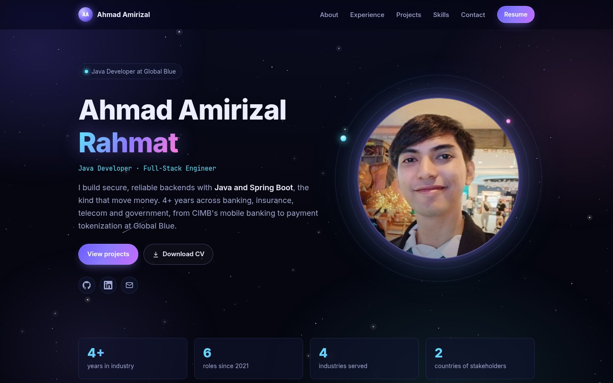
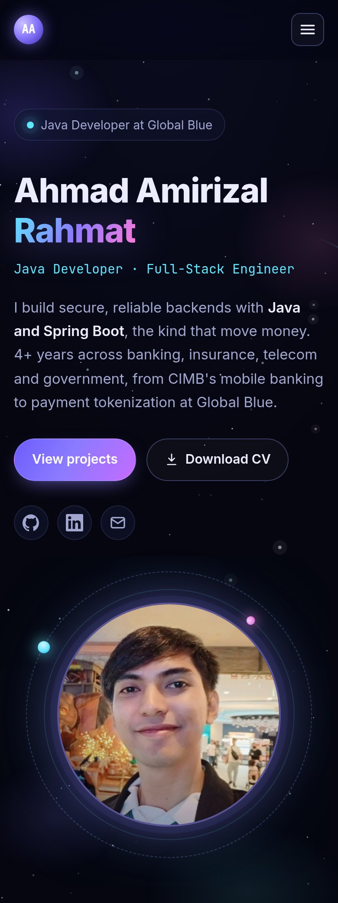

# myPortfolio

[](https://github.com/amirizalrahmat0799/myPortfolio/actions/workflows/pages/pages-build-deployment)


Personal portfolio of **Ahmad Amirizal Rahmat**, a Java Developer and Full-Stack Engineer in Kuala Lumpur
who builds secure Spring Boot backends for payments and banking.

**[Visit the site →](https://amirizalrahmat0799.github.io/myPortfolio/)**

<p align="center">
  
  &nbsp;
  
</p>

## Sections

Hero · About · Experience timeline · Projects · Skills · Education · Contact, plus a downloadable CV.

## Featured projects

The Projects section showcases a payment platform built piece by piece, plus a mobile app and CI/CD tooling:

| Project | What it is |
|---|---|
| [Payment Gateway Simulator](https://github.com/amirizalrahmat0799/payment-gateway-sim) | Event-driven card payment gateway: four Spring Boot microservices with Kafka, a transactional outbox and Spring Batch settlement |
| [Merchant Dashboard](https://github.com/amirizalrahmat0799/merchant-dashboard) ([live demo](https://amirizalrahmat0799.github.io/merchant-dashboard/)) | React 19 + TypeScript app merchants use to manage payments, refunds and payouts |
| [Payment Gateway on Kubernetes](https://github.com/amirizalrahmat0799/payment-gateway-k8s) | The whole platform on a 3-node kind cluster with Kustomize, Prometheus and Grafana, built as CKAD preparation |
| [Payment Assistant](https://github.com/amirizalrahmat0799/payment-assistant) | AI support assistant on Spring AI + Amazon Bedrock, using tool calling and RAG |
| [Kira](https://github.com/amirizalrahmat0799/kira-finance) ([APK](https://github.com/amirizalrahmat0799/kira-finance/releases/latest)) | Offline-first personal finance app: React Native (Expo) and SQLite, syncing through a Spring Boot API |
| [Jenkins CI Lab](https://github.com/amirizalrahmat0799/jenkins-ci-lab) | Starter CI/CD: a self-hosted Jenkins defined as code, with Jenkinsfile templates |

## Features

- **Plain HTML, CSS and JavaScript.** No framework, no build step, no dependencies besides Google Fonts.
- **Galaxy theme.** An animated canvas starfield (three depth layers, twinkle, shooting stars, gentle parallax) over a drifting nebula glow.
  The animation pauses when the tab is hidden, and its resolution is capped so it stays light on laptops and phones.
- **Accessible.** Skip link, keyboard-friendly navigation, visible focus styles, and a still starfield with no animations for visitors
  who prefer reduced motion.
- **Responsive** down to small phones, with a collapsible menu.
- **Discoverable.** SEO and social preview meta tags, plus JSON-LD `Person` schema.

## Structure

```
index.html
assets/
  css/site.css     theme and layout
  js/site.js       starfield, mobile menu, active section, scroll reveal
  img/             portrait, favicon, touch icon
  resume/          downloadable CV (PDF)
docs/              README screenshots
```

## Updating the site

- **Resume:** replace `assets/resume/Ahmad_Amirizal_Resume.pdf`, keeping the same file name so every download link keeps working.
- **Photo:** replace `assets/img/avatar.jpg` with a square image (about 480 × 480).
- **New project:** in `index.html`, copy an `<article class="card project">` block inside `.project-grid`, then change the text, chips and links.
  The grid shows three cards per row on desktop.
- **Screenshots:** retake `docs/preview-desktop.jpg` (1440 × 900) and `docs/preview-mobile.jpg` after big visual changes.

## Run locally

Open `index.html` in a browser, or serve the folder:

```bash
python -m http.server 8000   # http://localhost:8000
```

## Deploy

Every push to `main` is published by GitHub Pages, usually within a minute or two. If the site still looks old,
press **Ctrl+F5** to skip the browser cache.

## License

The code (HTML, CSS, JavaScript) is available under the MIT License. The photo, resume and written content are
© Ahmad Amirizal Rahmat, all rights reserved.
